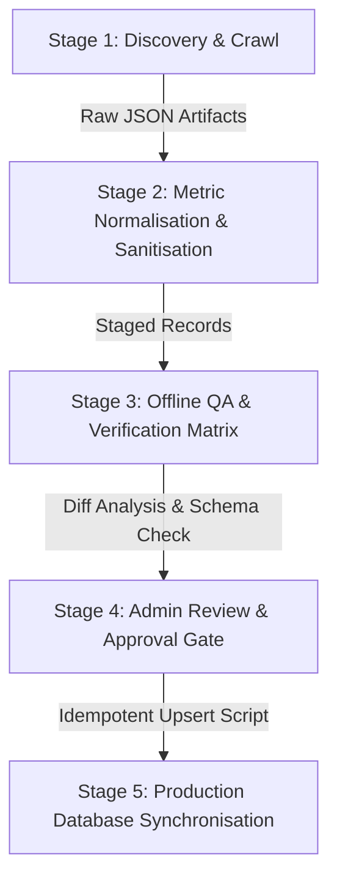

# Alkota UK — Phase 8.0: Machine Catalogue Ingestion & Migration Plan

**Document Version:** 1.0.0  
**Status:** PROPOSAL / BLUEPRINT ONLY — NO PRODUCTION DATA MODIFIED  
**Target Execution Phase:** Phase 8.1  
**Author:** Alkota UK Architectural Team  

---

## 1. Architectural Philosophy & Non-Destructive Guardrails

The Alkota UK machine catalogue is the foundational commercial asset of the business. Every route, technical selector, comparison matrix, enquiry dispatch, and SEO page relies on its accuracy and integrity. 

To maintain total system stability, any future ingestion or modification must adhere strictly to these non-negotiable principles:

> [!IMPORTANT]
> ### The Five Non-Negotiable Ingestion Rules
> 1. **Server Authority Over Scraped Data:** The server and database layer remain authoritative. Upstream changes from Alkota USA are staged and reviewed before promotion to live status.
> 2. **Protection of Localized UK Editorial:** Fields containing British English spelling, UK market context, local regulations, and curated SEO (`uk_description`, `meta_title`, `meta_description`) must **never** be overwritten by automated upstream synchronization.
> 3. **Immutability of Slugs & IDs:** Machine slugs (e.g. `alkota-420x4`) and database UUIDs are permanent keys. They must not be regenerated, renamed, or modified during imports to prevent 404 broken links or corrupted enquiry history.
> 4. **No Metric Fabrication:** Where manufacturer specifications are unverified or omitted on certain equipment types (e.g., pressure on parts washers), fields must remain `null`. Never invent surrogate numbers.
> 5. **Strict Provenance Tagging:** Every record and modified field must record its authoritative origin (`source_url`, `source_last_checked`, `source_verified_at`, `migration_status`).

---

## 2. Five-Stage Ingestion Lifecycle

The recommended migration execution flow for Phase 8.1 consists of five distinct, decoupled stages:



### Stage 1: Discovery & Upstream Extraction
- Execute deterministic scraper against the 36 known series endpoints on `alkota.com`.
- Extract raw specification tables, high-resolution cutouts, PDF brochure links, and engineering feature bullets.
- Output raw payload into isolated scratch artifact: `scripts/data/raw-upstream-extract.json`.

### Stage 2: Metric Normalisation & Sanitisation
- Convert imperial dimensions and capacities into British standards:
  - Pressure: `PSI * 0.0689476` → `pressure_bar` (rounded to integer or 1 decimal place).
  - Flow: `GPM * 3.78541` → `flow_rate_lpm` (rounded to 1 decimal place).
  - Weight: `lbs * 0.453592` → `weight_kg` (rounded to integer).
  - Dimensions: `inches * 25.4` → `dimensions_mm`.
- Execute automated sanitization routines:
  - Replace non-breaking spaces (`\u00a0`) with standard ASCII space in electrical strings.
  - Decode HTML entities (`&amp;` → `&`) in taglines and descriptions.
  - Fix dual-phase strings (`Phase: 1/3` on model `530B` normalized to `phase: 3` with `1/3` preserved in `extra_specs`).

### Stage 3: Offline QA & Validation Verification
- Execute `scripts/validate-catalogue.ts` against the staged JSON.
- Verify:
  - Zero duplicate slugs.
  - Zero duplicate model codes.
  - 100% image resolution (either local asset or valid CDN URL).
  - Valid status enum (`published`, `draft`, `archived`).
  - Active flag (`active: true`).

### Stage 4: Admin Review & Approval Gate
- Generate a machine-readable diff summary comparing `alkota-canonical-catalogue.json` against the staged data.
- Flag any changed specifications or newly introduced models (`108`, `4208`, `4308`, `5308`) with `needs_review: true`.
- Human sign-off required prior to database execution.

### Stage 5: Production Database Synchronization
- Run the idempotent seed script: `scripts/seed-products-to-db.ts`.
- Perform SQL upsert on conflict (`slug`).
- Preserve existing DB values for `uk_description`, `meta_title`, and `meta_description`.
- Record transaction in `import_logs` table.

---

## 3. Field-by-Field Migration & Authority Mapping

| Field | Ingestion Action | Protection Policy | Provenance Classification |
|---|---|---|---|
| `id` (UUID) | Retain existing / Generate if new | Immutable | `SYSTEM_GENERATED` |
| `slug` | Exact match on existing | Immutable | `EXISTING_VERIFIED_UK_DATA` |
| `model_code` | Authoritative match | Immutable | `ALKOTA_US_OFFICIAL` |
| `name` | Authoritative name | Upstream update allowed | `ALKOTA_US_OFFICIAL` |
| `series` | Authoritative series | Upstream update allowed | `ALKOTA_US_OFFICIAL` |
| `category` | Canonical category key | Protected | `EXISTING_VERIFIED_UK_DATA` |
| `description` | Upstream product overview | Upstream update allowed | `ALKOTA_US_OFFICIAL` |
| `uk_description` | **STRICTLY PROTECTED** | **NEVER OVERWRITE IF DB HAS VALUE** | `UK_EDITORIAL` |
| `meta_title` | **STRICTLY PROTECTED** | **NEVER OVERWRITE IF DB HAS VALUE** | `UK_EDITORIAL` |
| `meta_description` | **STRICTLY PROTECTED** | **NEVER OVERWRITE IF DB HAS VALUE** | `UK_EDITORIAL` |
| `pressure_psi` / `bar` | Metric converted | Calculated from source | `ALKOTA_US_OFFICIAL` |
| `flow_rate_gpm` / `lpm` | Metric converted | Calculated from source | `ALKOTA_US_OFFICIAL` |
| `voltage` / `phase` | Normalised electrical string | Sanitized (no `\u00a0`, no regex errors)| `ALKOTA_US_OFFICIAL` |
| `primary_image_url` | High-resolution CDN URL | Fallback to local asset if exists | `ALKOTA_US_OFFICIAL` |
| `pdf_spec_url` | Verified PDF brochure link | Kept null if unlinked at source | `ALKOTA_US_OFFICIAL_PDF` |
| `features` | Genuine mechanical bullets | Sanitized (no menu scrapings) | `ALKOTA_US_OFFICIAL` |
| `certifications` | Verified manufacturer certs | Stripped of invented claims | `ALKOTA_US_OFFICIAL` |

---

## 4. Ingestion Plan for Missing All-Electric Models

In Phase 8.1, the 4 models of the All-Electric Series will be added to the canonical snapshot and Supabase database.

```text
Target Category: hot-water
Target Series: All Electric Series
Source URL: https://alkota.com/products/hot-water-pressure-washers/power-washer-industrial-hot-water-all-electric-series/
Primary Image: https://alkota.com/wp-content/uploads/2023/07/All_Electric_Hot_Water_Pressure_Washer_02_Alkota-1-1024x1024.png
PDF Brochure: https://alkota.com/wp-content/uploads/2023/12/Tech_Data_Hot_Water_Pressure_Washer_All_Electric_Series_Alkota_12_23.pdf
```

### Individual Model Specifications to Stage:

1. **Alkota 108 (`alkota-108`)**
   - Flow: 1.7 GPM (6.4 L/min)
   - Pressure: 400 PSI (28 bar)
   - Power: 0.75 hp Electric Motor, 240/460V, 3-Phase, 60/120A
   - Heating: 60 kW Electric Immersion (6x 10kW elements)
   - Weight: 350 lbs (159 kg)
   - Dimensions: 864 x 610 x 940 mm (34" x 24" x 37")
   - Applications: Sanitary cleanrooms, pharmaceutical processing, indoor food plants.

2. **Alkota 4208 (`alkota-4208`)**
   - Flow: 3.5 GPM (13.2 L/min)
   - Pressure: 2000 PSI (138 bar)
   - Power: 5.0 hp Electric Motor, 240/460V, 3-Phase, 70/140A
   - Heating: 60 kW Electric Immersion (6x 10kW elements)
   - Weight: 485 lbs (220 kg)
   - Dimensions: 864 x 610 x 940 mm
   - Applications: Heavy food plant sanitisation, indoor zero-emission degreasing.

3. **Alkota 4308 (`alkota-4308`)**
   - Flow: 3.5 GPM (13.2 L/min)
   - Pressure: 3000 PSI (207 bar)
   - Power: 7.5 hp Electric Motor, 240/460V, 3-Phase, 75/150A
   - Heating: 60 kW Electric Immersion (6x 10kW elements)
   - Weight: 530 lbs (240 kg)
   - Dimensions: 864 x 610 x 940 mm
   - Applications: Industrial manufacturing wash bays, food packing plants.

4. **Alkota 5308 (`alkota-5308`)**
   - Flow: 4.8 GPM (18.2 L/min)
   - Pressure: 3000 PSI (207 bar)
   - Power: 10.0 hp Electric Motor, 460V, 3-Phase, 105A
   - Heating: 90 kW Electric Immersion (9x 10kW elements)
   - Weight: 530 lbs (240 kg)
   - Dimensions: 864 x 610 x 940 mm
   - Applications: High-volume continuous industrial indoor sanitisation.

---

## 5. Downstream Impact & Regression Safety Assessment

### 5.1 Help Me Choose (Machine Selection Engine)
- **Dependency:** Filters on `pressure_bar`, `flow_rate_lpm`, `power_source`, `voltage`, `phase`.
- **Impact of New Models:** In question step 4 (Power Source), choosing "Electric" will now present both fuel-heated (X4/AX4) and all-electric (4208/4308) options.
- **Safety Guarantee:** The selection engine separates verified vs unverified criteria and uses score-based ranking. Zero code changes required in `src/lib/machine-selection/`.

### 5.2 Machine Comparison Engine
- **Dependency:** Resolves models by `slug` query parameter (e.g. `?machines=alkota-420x4,alkota-4308`).
- **Impact:** Customers can side-by-side compare oil-fired vs all-electric hot water machines.
- **Safety Guarantee:** Comparison matrix parses `Product` interface dynamically. Zero code changes required in `src/lib/comparison/`.

### 5.3 Commercial Enquiry System (`/enquire`)
- **Dependency:** Resolves machine slugs against `products` table via `api/machines/search`.
- **Impact:** New models will immediately be selectable in enquiry cards with full engineering dossiers.
- **Safety Guarantee:** No schema or payload changes needed.

---

## 6. Pre-Execution Sign-Off Checklist (Phase 8.1 Readiness)

Before executing the migration script in Phase 8.1, the following conditions must be fulfilled:

- [ ] Current database snapshot exported and backed up to Supabase storage.
- [ ] Staged JSON validated with `scripts/validate-catalogue.ts` (0 errors, 0 duplicate slugs).
- [ ] Model `530B` phase corrected from `13` to `3` in staged JSON.
- [ ] Non-breaking spaces stripped across all 11 affected models.
- [ ] HTML entities decoded in all 12 affected taglines.
- [ ] 4 new All-Electric models drafted with complete British engineering copy in `uk_description`.
- [ ] Next.js production build (`npm run build`) verifies 0 compilation or type errors.
