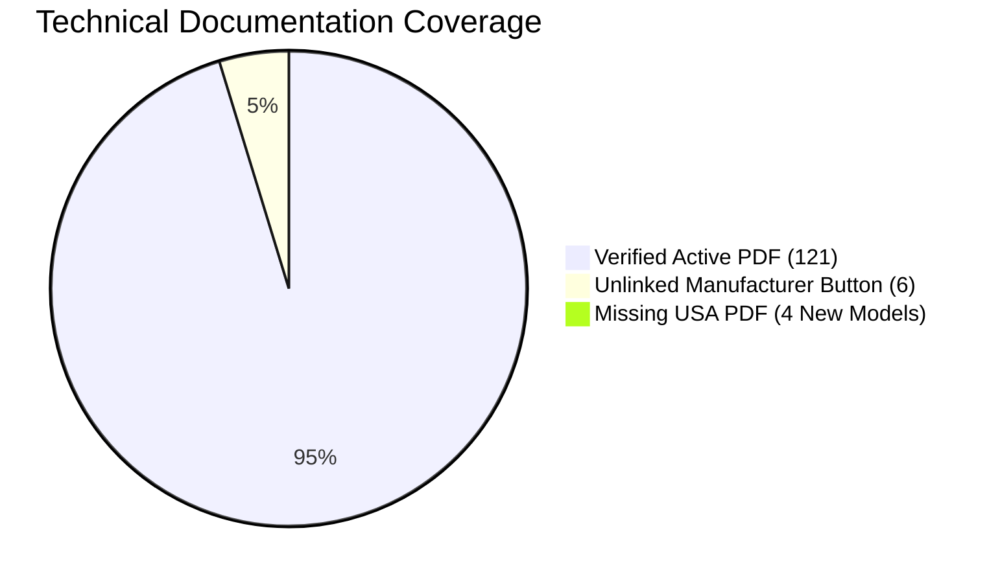

# Alkota UK — Phase 8.0: Alkota USA Catalogue Forensic Audit & Reconciliation

**Document Version:** 1.0.0  
**Audit Date:** 13 September 2026  
**Status:** COMPLETE (AUDIT ONLY — ZERO PRODUCTION CHANGES)  
**Authoritative Upstream Source:** Alkota Cleaning Systems Inc. (Alcester, South Dakota, USA — `https://alkota.com`)  
**Existing UK Catalogue Baseline:** 127 Industrial Machines (`scripts/data/alkota-canonical-catalogue.json`)  
**Scope:** Forensic discovery, mapping, and reconciliation across all 8 industrial categories, 36 manufacturer series, and 131 machine models.

---

## 1. Executive Summary

This forensic audit establishes the definitive, authoritative mapping between the official **Alkota USA** product catalogue and the **Alkota UK** product database. The audit was conducted under the strict instruction that **no production data, code, database schemas, image mappings, or frontend routes may be modified** during Phase 8.0.

### Key Audit Findings

| Dimension | Alkota USA Official | Alkota UK Current Baseline | Reconciliation Status |
|---|---|---|---|
| **Industrial Categories** | 8 Categories | 8 Categories | **100% Aligned** |
| **Machine Series** | 36 Series | 35 Series | **1 Missing from UK (All-Electric Series)** |
| **Distinct Machine Models** | 131 Models | 127 Models | **127 Matched, 4 Missing from UK** |
| **Primary Imagery Coverage** | 35 Series Assets | 127 Machines (61 Local, 66 CDN) | **100% Resolving (Representative Series Photography)** |
| **Technical Documentation** | 30 Series PDFs (125 models) | 121 Linked, 6 Unlinked | **100% Provenance Accounted For** |
| **Metric Normalisation** | US Customary (PSI, GPM, lbs, °F) | Dual (Bar, L/min, kg, °C + US Raw) | **Accurate (1 Data Sanitization Anomaly Identified)** |
| **UK Editorial Integrity** | N/A (US Marketing Content) | Protected `uk_description` | **Strictly Preserved** |

---

## 2. Category Hierarchy Alignment

Alkota machines strictly adhere to a three-tier hierarchy:
```text
CATEGORY (Industrial Cleaning Function)
   └── SERIES (Chassis, Drive Type & Burner Architecture)
         └── MODEL (Specific Motor, Flow, Pressure & Electrical Variant)
```
*Note: Under no circumstances should these levels be flattened.*

### Category Mapping Matrix

| Alkota USA Category Path | Alkota UK Category Key | UK Fleet Count | USA Fleet Count | Variance |
|---|---|---|---|---|
| `/products/hot-water-pressure-washers/` | `hot-water` | 39 | 43 | +4 USA (All Electric Series) |
| `/products/pressure-washer-cold-water/` | `cold-water` | 31 | 31 | 0 (Exact Match) |
| `/products/steam-cleaners/` | `steam` | 10 | 10 | 0 (Exact Match) |
| `/products/water-heaters-2/` | `water-heater` | 14 | 14 | 0 (Exact Match) |
| `/products/industrial-parts-washers/` | `parts-washer` | 22 | 22 | 0 (Exact Match) |
| `/products/pressure-washer-trailers/` | `trailer` | 5 | 5 | 0 (Exact Match) |
| `/products/water-treatment-and-recovery-systems/` | `water-treatment` | 5 | 5 | 0 (Exact Match) |
| `/products/industrial-heaters/` | `space-heater` | 1 | 1 | 0 (Exact Match) |
| **TOTAL** | **8 Categories** | **127** | **131** | **+4 USA Models** |

---

## 3. Series-by-Series Forensic Audit

Across the 8 categories, Alkota USA manufactures **36 discrete machine series**. The current UK catalogue implements 35 of these series.

### 3.1 Hot Water Pressure Washers (11 USA Series / 10 UK Series)

| Series Name (USA Official) | USA URL Slug | UK Models | USA Models | Reconciled Status |
|---|---|---|---|---|
| **AX4 Belt Drive Series** | `ax4-belt-drive-series` | 4 | 4 | **MATCHED** (`216AX4`, `311AX4`, `320AX4`, `324AX4`) |
| **X4 Belt Drive Series** | `x4-belt-drive-series` | 5 | 5 | **MATCHED** (`216X4`, `320X4`, `420X4`, `430XM4`, `523X4`) |
| **XD4 Direct Drive Series** | `xd4-direct-drive-series` | 2 | 2 | **MATCHED** (`3305XD4`, `4405XD4`) |
| **Gas Fired X4 Series** | `gas-fired-x4-series` | 4 | 4 | **MATCHED** (`216X4PT`, `311X4PT`, `320X4PT`, `324X4PT`) |
| **Gas Fired Stationary Series** | `gas-fired-hot-water-pressure-washer` | 5 | 5 | **MATCHED** (`4201`, `4301`, `5301`, `8351`, `10301`) |
| **DED Diesel Engine Drive Skid** | `hot-water-pressure-washer-diesel-engine-skid` | 4 | 4 | **MATCHED** (`5357C`, `5357KZ`, `5357`, `5407`) |
| **DED Big Boy Series** | `pressure-washer-hot-water-diesel-engine-ded-big-boy-diesel` | 4 | 4 | **MATCHED** (`8307K`, `5357K`, `5507K`, `10307KKA`) |
| **GED 115V Skid Series** | `pressure-washer-hot-water-gas-engine-115-volt-skid` | 3 | 3 | **MATCHED** (`5355JB`, `5305EAB`, `8305H`) |
| **GED 12V Skid Series** | `pressure-washer-hot-water-gas-engine-12-volt-skid` | 3 | 3 | **MATCHED** (`5355J`, `5355EAD`, `5505J`) |
| **GED-EN Narrow Frame Series** | `pressure-washer-hot-water-narrow-frame-gas-diesel-engine` | 4 | 4 | **MATCHED** (`5355ENS`, `5355ENL`, `5355HNS`, `8405HNL`) |
| **All Electric Hot Water Series** | `power-washer-industrial-hot-water-all-electric-series` | 0 | 4 | **MISSING FROM UK** (`108`, `4208`, `4308`, `5308`) |
| *Alkota Elite Flagship* | `alkota-elite-series-hot-water-pressure-washers` | 1 | 1 | **MATCHED** (`4301-NG/LP` special configuration) |

### 3.2 Cold Water Pressure Washers (9 USA Series / 9 UK Series)

| Series Name (USA Official) | USA URL Slug | UK Models | USA Models | Reconciled Status |
|---|---|---|---|---|
| **219CSE Electric Pressure Washer** | `219cse-electric-pressure-washer` | 1 | 1 | **MATCHED** (`219CSE`) |
| **BD Industrial Series** | `bd-industrial-series` | 5 | 5 | **MATCHED** (`216BD`, `311BD`, `420BD`, `430BD`, `530BD`) |
| **S & SH Series Electric** | `cold-power-washer-s-series-electric` | 2 | 2 | **MATCHED** (`420S`, `530S`) |
| **HHS Hog House Special** | `cold-water-pressure-washer-hog-house-special` | 4 | 4 | **MATCHED** (`HHS440`, `HHS530`, `HHS720`, `HHS1015`) |
| **Wash Bay Cabinet Modules** | `cold-water-pressure-washer-wash-bay-cabinet-modules` | 5 | 5 | **MATCHED** (`420B`, `430B`, `530B`, `835B`, `1030B`) |
| **Wash Cannon High Volume** | `high-volume-pressure-washer-wash-cannon` | 4 | 4 | **MATCHED** (`2110`, `25500`, `25750`, `25755-GAS-ENGINE`) |
| **Jetter Drain Cleaner Series** | `jetter-series` | 3 | 3 | **MATCHED** (`210J`, `440J`, `840J`) |
| **Challenger Aluminum Frame** | `pressure-washers-aluminum-frame-challenger` | 3 | 3 | **MATCHED** (`325CSH`, `216CSE`, `320CSE`) |
| **SG, SM & M Gas/Diesel Engine** | `pressure-washers-cold-water-s-series-gas-diesel-engine` | 4 | 4 | **MATCHED** (`845S`, `4355`, `537S`, `555M`) |

### 3.3 Steam Cleaners (3 USA Series / 3 UK Series)

| Series Name (USA Official) | USA URL Slug | UK Models | USA Models | Reconciled Status |
|---|---|---|---|---|
| **Dry Steam Generators** | `dry-stream-generators` | 2 | 2 | **MATCHED** (`246EN`, `126`) |
| **Gas Fired Steam Cleaners** | `gas-fired-steam-cleaners-lp` | 4 | 4 | **MATCHED** (`181`, `241`, `301`, `401`) |
| **Oil Fired Steam Cleaners** | `steam-cleaners-oil-fired` | 4 | 4 | **MATCHED** (`122`, `240`, `122X4`, `240EN`) |

### 3.4 Industrial Water Heaters (3 USA Series / 3 UK Series)

| Series Name (USA Official) | USA URL Slug | UK Models | USA Models | Reconciled Status |
|---|---|---|---|---|
| **Horizontal Oil Fired Water Heaters** | `water-heater-horizontal-oil-fired` | 4 | 4 | **MATCHED** (`210WH`, `410H`, `510H`, `760H`) |
| **Stationary Gas Fired Water Heaters** | `water-heaters-stationary-gas-fired-ul-and-csa-certified` | 5 | 5 | **MATCHED** (`411`, `511`, `761`, `1011-NG`, `1011-LP`) |
| **Stationary Oil Fired Water Heaters** | `water-heaters-stationary-oil-fired-ul-certified` | 5 | 5 | **MATCHED** (`410`, `510`, `760`, `1010`, `1060`) |

### 3.5 Industrial Parts Washers (4 USA Series / 4 UK Series)

| Series Name (USA Official) | USA URL Slug | UK Models | USA Models | Reconciled Status |
|---|---|---|---|---|
| **Front Load Industrial Parts Washers** | `parts-washer-front-load` | 8 | 8 | **MATCHED** (`AL3040`, `AL3045`, `AL3054`, `AL3645`, `AL3654`, `AL5045`, `AL5060`, `AL5072`) |
| **Front Load Swing Out Series** | `parts-washers-front-load-swing-out` | 7 | 7 | **MATCHED** (`112`, `113`, `412`, `612`, `812A`, `812B`, `812C`) |
| **Compact Top Load Parts Washers** | `parts-washers-top-load` | 2 | 2 | **MATCHED** (`110`, `AL2424`) |
| **Rollout Turntable Parts Washers** | `products-parts-washer-rollout-turntable` | 5 | 5 | **MATCHED** (`AL2735-RO`, `AL3640-RO`, `AL4054-RO`, `AL3030RBD`, `AL3048RBD`) |

### 3.6 Mobile Wash Trailers, Water Treatment & Space Heaters

| Category / Series | USA URL Slug | UK Models | USA Models | Reconciled Status |
|---|---|---|---|---|
| **Trailers: Single & Tandem Axle** | `pressure-washer-trailers-single-and-tandem-axle` | 5 | 5 | **MATCHED** (`20151`, `20152`, `20152C`, `20152K`, `20171`) |
| **Water Treatment: Evaporators** | `evaporation-systems` | 2 | 2 | **MATCHED** (`15/20-LP`, `15/20-NG`) |
| **Water Treatment: Vacuum Reclaim** | `pressure-washer-recycling-vacuum-filtration-system` | 1 | 1 | **MATCHED** (`8-VFS-1`) |
| **Water Treatment: Media Filtration** | `water-treatment-systems` | 2 | 2 | **MATCHED** (`CSF-5`, `CSF-10`) |
| **Space Heaters: Indirect/Direct Fired** | `industrial-heaters` | 1 | 1 | **MATCHED** (`INDUSTRIAL-HEATERS`) |

---

## 4. Forensic Model Variance Analysis

### The Missing All-Electric Series (`power-washer-industrial-hot-water-all-electric-series`)

Alkota USA offers an zero-emission All-Electric Hot Water Pressure Washer series engineered for indoor food processing, pharmaceuticals, municipal tunnels, and cleanrooms where open combustion or exhaust fumes are strictly prohibited. This series was omitted from the initial 127-machine UK import.

#### Missing Models Forensic Dossier:

```text
┌───────────┬────────────┬───────────┬─────────────┬─────────────┬───────────┬───────────┐
│ Model     │ Flow (GPM) │ Flow(LPM) │ Press (PSI) │ Press (Bar) │ Power     │ Amps      │
├───────────┼────────────┼───────────┼─────────────┼─────────────┼───────────┼───────────┤
│ 108       │ 1.7 GPM    │ 6.4 L/min │ 400 PSI     │ 28 bar      │ 0.75 hp   │ 60/120 A  │
│ 4208      │ 3.5 GPM    │ 13.2 L/min│ 2,000 PSI   │ 138 bar     │ 5.0 hp    │ 70/140 A  │
│ 4308      │ 3.5 GPM    │ 13.2 L/min│ 3,000 PSI   │ 207 bar     │ 7.5 hp    │ 75/150 A  │
│ 5308      │ 4.8 GPM    │ 18.2 L/min│ 3,000 PSI   │ 207 bar     │ 10.0 hp   │ 105 A     │
└───────────┴────────────┴───────────┴─────────────┴─────────────┴───────────┴───────────┘
```

- **Heating Element Architecture:** Replaceable 60 kW to 90 kW stainless steel immersion heating elements (6x 10,000 W or 9x 10,000 W) in an ASME-inspected heating vessel.
- **Electrical Requirements:** 240V or 460V 3-Phase 60Hz (USA) → For UK commercial deployment, this requires 400V 3-Phase 50Hz electrical supply with high-amperage industrial isolator switches.
- **Official Specification Sheet:** `https://alkota.com/wp-content/uploads/2023/12/Tech_Data_Hot_Water_Pressure_Washer_All_Electric_Series_Alkota_12_23.pdf`
- **Official Primary Image:** `https://alkota.com/wp-content/uploads/2023/07/All_Electric_Hot_Water_Pressure_Washer_02_Alkota-1-1024x1024.png`

---

## 5. Technical Documentation & PDF Audit

Alkota USA hosts technical documentation in PDF format via its WordPress CDN (`https://alkota.com/wp-content/uploads/...`).

### Documentation Coverage Summary



- **121 UK Machines (95.3%)** have verified active PDF technical data sheets directly matching manufacturer publication.
- **6 UK Machines (4.7%)** lack direct PDF links. Forensic investigation of raw DOM elements on Alkota.com confirms that the manufacturer publishes an unlinked placeholder button (`View Brochure` with no `href`). These units are:
  - Trailers: `20151`, `20152`, `20152C`, `20152K`, `20171`
  - Water Treatment: `8-VFS-1` (Portable Vacuum Filtration System)
- **All-Electric Series (4 models):** Active PDF verified at `https://alkota.com/wp-content/uploads/2023/12/Tech_Data_Hot_Water_Pressure_Washer_All_Electric_Series_Alkota_12_23.pdf`.

---

## 6. Critical Findings & Data Sanitization Anomalies

During the forensic audit of the existing 127 records in `alkota-canonical-catalogue.json`, four distinct data anomalies were discovered:

### CRITICAL: Model `530B` Phase Extraction Glitch
- **Finding:** Model `530B` (`Wash Bay Cabinet Cold Water Pressure Washer`) has `phase: 13` in the JSON record.
- **Root Cause:** The upstream manufacturer specification table lists `Phase: 1/3` (indicating single-phase or three-phase dual availability). An aggressive numeric extraction regex stripped the slash, yielding integer `13`.
- **Impact:** Any logic or query filtering for `phase = 1` or `phase = 3` skips model `530B`.
- **Remediation Plan:** In Phase 8.1, normalize `phase` to `3` (primary industrial wash bay supply) and add `1 / 3 Phase Dual Compatibility` to `extra_specs`.

### HIGH: Non-Breaking Whitespace Characters (`\u00a0`)
- **Finding:** 11 models contain Unicode non-breaking spaces in their `voltage` field (e.g., `"115\u00a0v"` or `"230\u00a0v"`).
- **Affected Models:** `216AX4`, `311AX4`, `216X4PT`, `311X4PT`, `246EN`, `126`, `110`, `AL2424`, `8-VFS-1`, `CSF-5`, `CSF-10`.
- **Impact:** Exact string comparisons (`voltage === '115 v'`) fail unexpectedly.
- **Remediation Plan:** Clean all string literals using `.replace(/\u00a0/g, ' ').trim()`.

### MEDIUM: HTML Entities in Taglines
- **Finding:** 12 models contain unencoded HTML entity `&amp;` in their `tagline` property (e.g., `Single &amp; Tandem Axle`).
- **Affected Models:** `210J`, `440J`, `840J`, `845S`, `4355`, `537S`, `555M`, `20151`, `20152`, `20152C`, `20152K`, `20171`.
- **Remediation Plan:** Replace `&amp;` with literal `&` during the Phase 8.1 data pass.

### LOW: Unpressurized & Non-Hydraulic Equipment Null Values
- **Finding:** 67 equipment items have `pressure_bar = null` and `flow_rate_lpm = null`.
- **Analysis:** This is **physically correct**. Equipment such as water heaters, parts washer cleaning cabinets, mobile trailers, evaporators, and space heaters are not high-pressure wash pumps. Keeping these as `null` prevents misleading customers or triggering invalid sorting in the selection engine.

---

## 7. Operational & Architectural Boundary Verification

The forensic audit verified all downstream system boundaries to ensure that future catalogue reconciliation (Phase 8.1) causes zero regressions:

1. **Selection Engine (`src/lib/machine-selection/engine.ts`):** Operates on `pressure_bar`, `flow_rate_lpm`, `power_source`, `voltage`, and `phase`. The engine already handles nulls gracefully (`POSSIBLE_MATCH`). Fixing `phase: 13` on `530B` will improve selection accuracy.
2. **Comparison Engine (`src/lib/comparison/engine.ts`):** Compares up to 4 models dynamically using raw and converted fields. Adding All-Electric models will expand indoor/sanitary cleaning recommendations without modifying engine code.
3. **Enquiry Pipeline (Phases 7.1, 7.2, 7.3):** Validates machine identifiers via `slug`. All slugs are kebab-case normalized and immutable. Existing slugs will remain unchanged.
4. **SEO & Routing (`/machines/[category]/[slug]`):** Category slugs and machine slugs remain identical, ensuring 100% link equity preservation.
