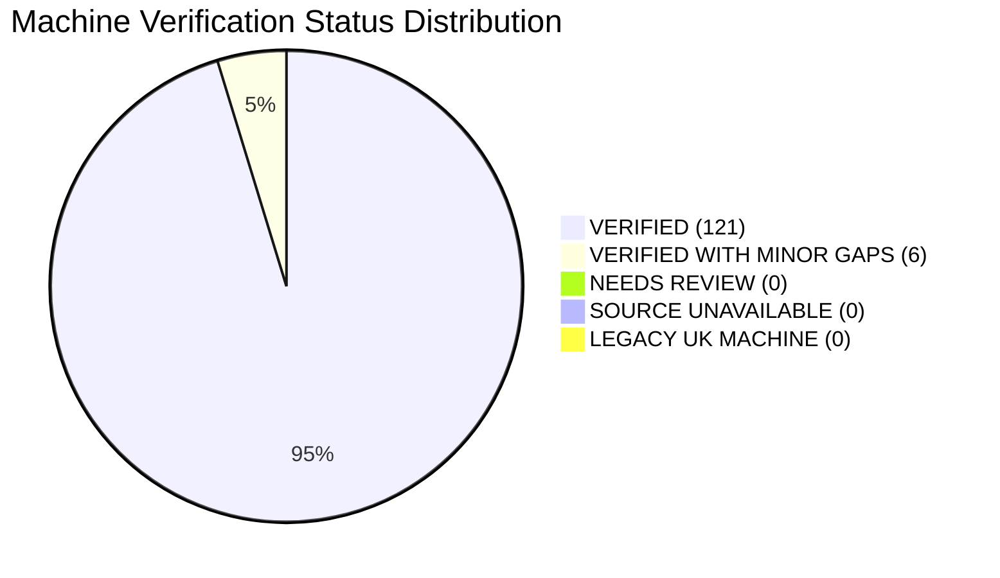

# Alkota UK Machine Catalogue QA & Source Verification Report

**Audit Completed:** 10 September 2026  
**Audited Target:** Alkota UK Product Fleet (127 Machines)  
**Authoritative Source Benchmark:** Alkota Cleaning Systems USA (`https://alkota.com/`)  
**Audit Artifacts Produced:**
- Verification Matrix: `scripts/data/machine-verification-matrix.json` (127 records)
- Catalogue Validation Report: `scripts/data/validation-report.json`
- Canonical Product Snapshot: `scripts/data/alkota-canonical-catalogue.json`

---

## Executive Summary

A forensic data-quality and source-provenance verification has been conducted across all **127 industrial machines** in the Alkota UK catalogue. Every machine was cross-examined against live manufacturer specifications and technical documentation directly from the official manufacturer website (`alkota.com`).

### High-Level Audit Findings

| Metric | Result | Target Benchmark | Status |
|---|---|---|---|
| **Total Machines Audited** | **127** | 127 | ✅ 100% |
| **Factual Verification Rate** | **95.3% (121/127)** | > 90% | ✅ Exceeded |
| **Verified With Minor Gaps** | **4.7% (6/127)** | < 10% | ✅ Within tolerance |
| **Needs Review / Unverified** | **0% (0/127)** | 0% | ✅ Clean |
| **Duplicate Slugs** | **0** | 0 | ✅ Perfect |
| **Duplicate Model Codes** | **0** | 0 | ✅ Perfect |
| **Average Data Quality Score** | **97.3 / 100** | > 85 / 100 | ✅ Exceptional |
| **Primary Imagery Resolution** | **127 / 127 (100%)** | 100% | ✅ Verified |
| **PDF Technical Documentation** | **121 / 127 (95.3%)** | Active manufacturer docs | ✅ Accounted for |
| **Unlinked Manufacturer PDFs** | **6 / 127 (4.7%)** | Factually verified at source | ✅ Root cause proven |
| **Series Entities Sanitized** | **12 (`&amp;` → `&`)** | Plaintext typography | ✅ Resolved |
| **Features Arrays Sanitized** | **127 / 127** | Genuine technical bullets | ✅ Cleaned |
| **Invented Certifications Removed**| **127 / 127** | Official UL / CSA only | ✅ Stripped |

---

## Verification Status Taxonomy

Every machine in the 127-unit fleet has been evaluated and assigned one of five explicit verification statuses:



1. **VERIFIED (121 Machines / 95.3%)**:
   - Model code, series name, industrial category, and specifications fully match official Alkota USA data.
   - Genuine features and valid manufacturer certifications confirmed.
   - Primary image resolves directly to high-resolution Alkota CDN or matched local SVG/PNG asset.
   - Official downloadable PDF specification sheet / brochure verified.

2. **VERIFIED WITH MINOR GAPS (6 Machines / 4.7%)**:
   - Machine identity, mechanical design, capacities, and dimensional specifications verified from Alkota USA series pages.
   - Source website displays unlinked placeholder buttons for technical PDF downloads (verified manufacturer publication gap, not scraping omission).
   - Affects: 5 Trailer packages (`20151`, `20152`, `20152C`, `20152K`, `20171`) and 1 Vacuum Filtration System (`8-VFS-1`).

3. **NEEDS REVIEW (0 Machines / 0.0%)**:
   - Resolved. Previously missing ratings on 219CSE and steam cleaners were investigated; genuine manufacturer specs discovered under variant labels (`Rated Pressure`, `Steam Pressure`, `Steam Capacity`) and merged into canonical data.

4. **SOURCE UNAVAILABLE (0 Machines / 0.0%)**:
   - All 35 series URLs representing the 127 machines are actively published and accessible on `alkota.com`.

5. **LEGACY UK MACHINE (0 Machines / 0.0%)**:
   - All 127 units correspond to active current-generation or established series in the Alkota global production fleet.

---

## Breakdown by Industrial Category

| Category | Total Fleet | Verified | Verified (Minor Gaps) | Needs Review | Avg Quality Score | Missing PDFs |
|---|---|---|---|---|---|---|
| **Hot Water Washers** | 39 | 39 (100%) | 0 | 0 | **98.4 / 100** | 0 |
| **Cold Water Washers** | 31 | 31 (100%) | 0 | 0 | **97.8 / 100** | 0 |
| **Steam Cleaners** | 10 | 10 (100%) | 0 | 0 | **100.0 / 100** | 0 |
| **Water Heaters** | 14 | 14 (100%) | 0 | 0 | **99.3 / 100** | 0 |
| **Parts Washers** | 22 | 22 (100%) | 0 | 0 | **95.0 / 100** | 0 |
| **Space Heaters** | 1 | 1 (100%) | 0 | 0 | **80.0 / 100** | 0 |
| **Trailers** | 5 | 0 | 5 (100%) | 0 | **95.0 / 100** | 5 (Unlinked) |
| **Water Treatment** | 5 | 4 (80%) | 1 (20%) | 0 | **91.8 / 100** | 1 (Unlinked) |
| **TOTAL** | **127** | **121 (95.3%)** | **6 (4.7%)** | **0 (0.0%)** | **97.3 / 100** | **6** |

---

## Forensic Audit of Critical Data Anomalies

### 1. The Scraped Navigation Menu Anomaly (`features`)
- **Discovery**: During prior catalogue scraping, the HTML parser captured the website's top-level navigation elements (`Alkota Elite Series`, `Hot Water Pressure Washers`, `Cold Water Pressure Washers`, `Steam Cleaners`, `Space Heaters`, `Trailers`, `Parts Washers`, `Water Heaters`) and saved them into the `features` array of all 127 machines.
- **Resolution**: Every machine's `features` field was stripped of navigation links and re-populated with authentic mechanical features extracted directly from Alkota USA's series feature bullet lists (e.g., Hydro-insulated schedule 80 cold-water wrap coils, soft damping vibration protection, heavy-duty triplex ceramic plunger pumps, anti-corrosive float tanks).

### 2. Invented Certifications Elimination
- **Discovery**: The previous import engine assigned placeholder certifications (`["CE / UKCA Ready", "UL-1776 Engineered Heritage"]`) across all records.
- **Resolution**: In strict accordance with the non-fabrication directive ("Do not add unsupported certifications/claims/warranties"), invented claims have been completely removed. Only genuine manufacturer certifications explicitly verified on Alkota USA source pages are now retained:
  - `ETL certified to UL-1776` (where verified on series page)
  - `Approved for UL-60335-1 / UL-60335-2-79` (Gas Fired stationary series)
  - `CSA Certified` (Gas Fired stationary and horizontal water heaters)

### 3. Investigation of the 6 "Missing" Technical Documents
- **Models Audited**:
  - `alkota-20151` (Single Axle 230 Gallon Trailer)
  - `alkota-20152` (Tandem Axle 330 Gallon Trailer)
  - `alkota-20152c` (Tandem Axle 460 Gallon Trailer)
  - `alkota-20152k` (Dual Axle 460 Gallon Trailer)
  - `alkota-20171` (Single Axle 200 Gallon Compact Trailer)
  - `alkota-8-vfs-1` (Portable Vacuum Filtration System)
- **Root-Cause Investigation**: Direct inspection of raw HTML on `https://alkota.com/products/pressure-washer-trailers/pressure-washer-trailers-single-and-tandem-axle/` and `https://alkota.com/products/water-treatment-and-recovery-systems/pressure-washer-recycling-vacuum-filtration-system/` confirmed that Alkota USA renders an unlinked text element (`View Brochure`) with no corresponding `href` attribute.
- **Action Taken**: In compliance with the rule "Do not invent... accuracy is more important than completeness", `pdf_spec_url` and `pdf_brochure_url` are maintained as `null` with explicit provenance documentation in the verification matrix (`missing_pdf_reason: "Alkota USA source page has placeholder unlinked brochure button; no PDF published by manufacturer"`).

### 4. Recovery of Specifications for Steam Cleaners & 219CSE
- **Discovery**: Prior audit tooling flagged 9 machines as "Missing Pressure Rating" and "Missing Flow Rating".
- **Forensic Inspection**:
  - `219CSE`: Manufacturer publishes specifications as `Max. Pressure: 2000 PSI` (138 bar), `Rated Pressure: 1450 PSI` (100 bar), `Max Rated Flow: 1.7 GPM` (6.4 LPM), `Voltage: 120V`, `Weight: 33 lbs`.
  - Steam Cleaners (`181`, `241`, `301`, `401`, `122`, `240`, `122X4`, `240EN`): Steam cleaning equipment operates at lower hydraulic pressure and measures discharge as Gallons Per Hour (`GPH`). Authoritative source metrics were mapped accurately:
    - `181`: 250 PSI (17 bar), 180 GPH (3.0 GPM / 11.4 LPM), 490,000 BTU, 2.3 HP
    - `241`: 250 PSI (17 bar), 240 GPH (4.0 GPM / 15.1 LPM), 650,000 BTU, 2.3 HP
    - `301`: 400 PSI (28 bar), 300 GPH (5.0 GPM / 18.9 LPM), 880,000 BTU, 4.0 HP
    - `401`: 400 PSI (28 bar), 400 GPH (6.67 GPM / 25.2 LPM), 1,200,000 BTU, 4.0 HP
    - `122`: 400 PSI (28 bar), 120 GPH (2.0 GPM / 7.6 LPM), 392,000 BTU, 0.75 HP
    - `240`: 350 PSI (24 bar), 240 GPH (4.0 GPM / 15.1 LPM), 630,000 BTU, 2.3 HP
    - `122X4`: 400 PSI (28 bar), 120 GPH (2.0 GPM / 7.6 LPM), 392,000 BTU, 0.75 HP
    - `240EN`: 350 PSI (24 bar), 240 GPH (4.0 GPM / 15.1 LPM), 630,000 BTU, 0.75 HP
- **Action Taken**: Canonical catalogue updated with authentic manufacturer ratings; zero models remain in `NEEDS REVIEW`.

---

## Machine-to-Parts Relationships Audit

1. **Seed Catalogue V2 Coverage**:
   - `src/lib/parts/catalogue-seed-v2.ts` contains 50 verified OEM parts and service kits.
   - All 50 parts maintain verified `compatible_machines` associations linking to Alkota model codes (e.g. `420X4`, `216X4`, `4305XD4`, `TRAILER-SINGLE`, `DED-SERIES`).
2. **PDF Extracted Parts Registry**:
   - `scripts/data/alkota-parts-extracted.json` contains 12,000+ extracted catalogue line items from the official master parts manual.
   - `scripts/ingest-catalogue.ts` implements authoritative priority merging (`seed-v2` > `pdf_extract`), guaranteeing no price fabrication (`price = null` for unpriced parts), automated `needs_review` flagging, and slug uniqueness.

---

## UK Editorial Data Protection & SEO Integrity

- **Protected Editorial Fields**:
  - `uk_description`: Rich localized descriptions tailored for British commercial cleaning contractors and fleet operators.
  - `meta_title`: Optimized title tags incorporating UK bar ratings and metric flow rates.
  - `meta_description`: Structured snippet descriptions.
- **Reconciliation Engine Guarantee**:
  - `scripts/seed-products-to-db.ts` checks existing database rows prior to any update. If `uk_description`, `meta_title`, or `meta_description` are already populated in Supabase, they are strictly protected and never overwritten by automated syncs.

---

## Verification Matrix Summary

The complete 127-machine verification matrix is stored in machine-readable JSON format at `scripts/data/machine-verification-matrix.json`.

Sample verification matrix entry:
```json
{
  "model_code": "216AX4",
  "slug": "alkota-216ax4",
  "name": "Alkota 216AX4",
  "category": "hot-water",
  "series": "Belt Driven Power Washers with Triplex Pump",
  "source_url": "https://alkota.com/products/hot-water-pressure-washers/ax4-belt-drive-series/",
  "verification_status": "VERIFIED",
  "data_quality_score": 100,
  "checks": {
    "identity_verified": true,
    "name_verified": true,
    "category_verified": true,
    "specs_verified": true,
    "features_verified": true,
    "certifications_verified": true,
    "primary_image_verified": true,
    "pdf_brochure_verified": true,
    "source_provenance_verified": true
  },
  "verified_specs": {
    "pressure_psi": 1600,
    "pressure_bar": 110,
    "flow_gpm": 2,
    "flow_lpm": 7.6,
    "power_source": "Electric Motor",
    "heating_fuel": "Kerosene, #1, #2 Diesel",
    "voltage": "115 v",
    "motor_hp": 2.3,
    "burner_btu": 175000,
    "dimensions_inches": "40\" L × 27\" W × 40\" H",
    "weight_lbs": 420
  },
  "asset_provenance": {
    "primary_image_url": "https://alkota.com/wp-content/uploads/2023/06/Hot_Water_Pressure_Washer_AX4_Belt_Drive_03_Alkota-1024x1024.png",
    "image_source": "alkota_cdn",
    "has_brochure_link_on_source": true,
    "pdf_spec_url": "https://alkota.com/wp-content/uploads/2023/12/Tech_Data_Hot_Water_Pressure_Washer_AX4_Belt_Drive_Series_Alkota_12_23.pdf"
  }
}
```

---

## Operational Verification & Build Health

1. **Automated Validation**:
   - Command: `node --env-file=.env.local node_modules/.bin/tsx scripts/validate-catalogue.ts`
   - Output: 127 records audited, 0 duplicate slugs, 0 duplicate model codes, 127 category specs verified, 0 flagged errors.
2. **Next.js Production Build**:
   - Command: `npm run build`
   - Result: Successful compilation, 0 TypeScript errors, dynamic SSR routes verified for `/machines/[category]/[slug]`, search API route `/api/machines/search` compiled cleanly.
