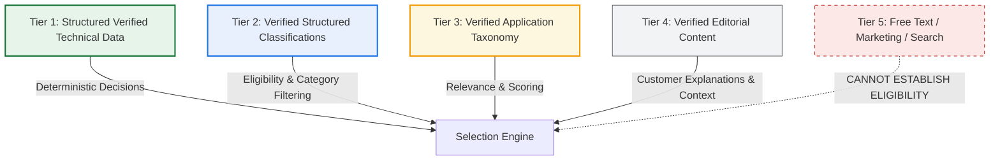

# Alkota UK — Machine Data Authority Map

**Date:** 10 September 2026  
**Phase:** Phase 6 Architecture Deliverable  
**Status:** Authoritative Technical Mapping Reference  
**Specification:** Phase 6 Supplementary Requirement (Define Authoritative Machine Data Mapping)  

---

## 1. Architectural Purpose & The Golden Rule

The Alkota UK machine selection engine (`/machines/help-me-choose`) is an **evidence-based deterministic system**. It must answer:

> *"Which machines satisfy the customer's stated requirements based on verified engineering facts?"*

It must **never** answer:

> *"What machine does an AI guess might work?"*

To maintain engineering integrity, the selection engine is strictly prohibited from:
- Searching arbitrary free-text descriptions to infer numerical specifications.
- Inferring fuel, voltage, or duty ratings from product names or marketing copy.
- Converting missing values into false/negative assumptions (e.g. `unspecified flow` must never become `0 L/min` or `fail`).
- Treating commercial product relationships (`RELATED_PRODUCT`) as engineering fitment evidence.
- Deriving technical capability from product imagery.

### The Rule of Provenance:
$$\text{Authoritative Source} \longrightarrow \text{Verification} \longrightarrow \text{Structured DB Field} \longrightarrow \text{Deterministic Selector}$$

---

## 2. Authoritative Data Hierarchy

The selection engine evaluates machine records using a five-tier hierarchy of authority:

1. **Tier 1 — Structured Verified Technical Data (Highest Authority)**:
   - Database fields: `pressure_bar`, `pressure_psi`, `flow_rate_lpm`, `flow_rate_gpm`, `max_temp_c`, `power_source`, `heating_fuel`, `voltage`, `phase`, `amp_requirement`, `motor_kw`, `motor_hp`, `engine_details`, `burner_btu`, `dimensions_mm`, `weight_kg`.
   - Used for hard mathematical inequalities (e.g. `pressure_bar >= min_pressure`) and electrical feasibility.
2. **Tier 2 — Verified Structured Classification**:
   - Database fields: `category`, `series`, `portable`, `mobility`, `status`, `active`.
   - Used for primary eligibility (e.g. hot water vs cold water vs steam, trailer vs stationary).
3. **Tier 3 — Verified Application Taxonomy**:
   - Database fields: `applications: text[]`, `industries: text[]`, `duty_application: text`.
   - Used for preference scoring and use-case alignment (e.g. fleet cleaning, agricultural washdown, bitumen removal).
4. **Tier 4 — Verified Editorial Content**:
   - Database fields: `uk_description`, `tagline`, `engineering_story`.
   - Used exclusively for human explanation and "Why this machine matched" customer copy. Never used as a substitute for numerical data.
5. **Tier 5 — Free Text / Unstructured Content**:
   - Database fields: `description`, `features: text[]`, `options: text[]`.
   - May be displayed as supplementary information. **Forbidden** from establishing engineering eligibility.

---

## 3. Field Authority Matrix

| Customer Requirement | Authoritative Database Column | TypeScript Property | Data Type & Base Unit | Verification Requirement | Selection Role | Missing Data Behaviour | Real Catalogue Example |
|---|---|---|---|---|---|---|---|
| **Machine Category** | `category` | `category` | `text` (enum) | Verified canonical catalogue | Hard Eligibility | `FAIL` (Must match category) | `'hot-water'`, `'cold-water'`, `'steam'`, `'trailer'`, `'parts-washer'` |
| **Hot Water Cleaning** | `category` + `heating_fuel` | `category`, `heating_fuel` | `text` | Verified thermal assembly | Hard Eligibility | `FAIL` if unheated | `category: 'hot-water'`, `heating_fuel: 'Diesel / Kerosene'` (420X4) |
| **Cold Water Cleaning** | `category` | `category` | `text` | Verified ambient assembly | Hard Eligibility | `PASS` for cold water; hot water machines also qualify if temperature dial down allowed | `category: 'cold-water'` (BD Industrial) |
| **Pure Steam** | `category` + `max_temp_c` | `category`, `max_temp_c` | `text` / `integer` (°C) | Verified wet-steam generator | Hard Eligibility | `FAIL` if standard pressure washer | `category: 'steam'`, `max_temp_c: 165` (122 Steam) |
| **Operating Pressure** | `pressure_bar` / `pressure_psi` | `pressure_bar`, `pressure_psi` | `integer` (Base: `bar`) | Factory pump test rating | Numeric Threshold | `UNKNOWN` (Never Fail) | `pressure_bar: 138`, `pressure_psi: 2000` (420X4) |
| **Water Flow Rate** | `flow_rate_lpm` / `flow_rate_gpm` | `flow_rate_lpm`, `flow_rate_gpm` | `numeric` (Base: `L/min`) | Factory nozzle flow rating | Numeric Threshold | `UNKNOWN` (Never Fail) | `flow_rate_lpm: 15.1`, `flow_rate_gpm: 4.0` (420X4) |
| **Max Operating Temp** | `max_temp_c` | `max_temp_c` | `integer` (°C) | Boiler design limit | Numeric Threshold | `UNKNOWN` (Ambient for cold) | `max_temp_c: 98` (420X4) |
| **Heating Fuel** | `heating_fuel` | `heating_fuel` | `text` | Burner manifold spec | Hard / Preference | `UNKNOWN` | `'Kerosene, #1, #2 Diesel'`, `'Natural Gas or LP'` |
| **Power Source** | `power_source` | `power_source` | `text` | Motor/engine classification | Hard / Preference | `UNKNOWN` | `'Electric Motor'`, `'Petrol / Diesel Engine'` |
| **Electrical Voltage** | `voltage` | `voltage` | `text` | Motor nameplate | Hard Eligibility (if electric) | `UNKNOWN` (Worth confirming) | `'230V'`, `'400V'`, `'115V'` |
| **Electrical Phase** | `phase` | `phase` | `integer` (1 or 3) | Motor winding | Hard Eligibility (if electric) | `UNKNOWN` (Worth confirming) | `phase: 1` (Single Phase), `phase: 3` (3-Phase) |
| **Full Load Amperage** | `amp_requirement` | `amp_requirement` | `numeric` (Amps) | Breaker requirement | Hard Eligibility (if electric) | `UNKNOWN` (Worth confirming) | `amp_requirement: 30` (420X4 230V 1PH) |
| **Motor Power** | `motor_kw` / `motor_hp` | `motor_kw`, `motor_hp` | `numeric` (kW / HP) | Motor rating | Informational / Display | `UNKNOWN` | `motor_kw: 6.0`, `motor_hp: 8.0` (420X4) |
| **Engine Details** | `engine_details` | `engine_details` | `text` | Engine manufacturer | Informational / Display | `UNKNOWN` | `'Honda GX390 with electric start'` |
| **Pump Architecture** | `pump_type` | `pump_type` | `text` | Pump engineering spec | Preference / Display | `UNKNOWN` | `'Oil Bath Crankcase\|Triplex Ceramic Plunger'` |
| **Thermal Burner** | `burner_btu` | `burner_btu` | `integer` (BTU/hr) | Burner nozzle rating | Informational / Display | `UNKNOWN` | `burner_btu: 385000` (420X4) |
| **Chassis Mobility** | `mobility` + `portable` | `mobility`, `portable` | `text` + `boolean` | Frame specification | Hard / Preference | `UNKNOWN` | `mobility: '4-Wheel Heavy-Duty Pneumatic Chassis'`, `portable: true` |
| **Turnkey Trailer Rig** | `category` | `category` | `text` | Turnkey highway trailer | Hard / Preference | `FAIL` if non-trailer | `category: 'trailer'` (20151, 20152) |
| **Stationary Cabinet** | `mobility` + `portable` | `mobility`, `portable` | `text` + `boolean` | Wash bay enclosure | Hard / Preference | `UNKNOWN` | `portable: false`, `mobility: 'Stationary Enclosed Cabinet'` |
| **Water Tank Capacity** | `extra_specs` | `extra_specs` (JSON) | `numeric` (Gallons / Litres) | Trailer tank specification | Numeric Requirement | `UNKNOWN` (Worth confirming) | `extra_specs: [{"label": "Water Tank", "value": "200 Gallons"}]` |
| **Cleaning Application** | `applications` + `industries` | `applications`, `industries` | `text[]` | Verified use-case list | Relevance Scoring | Non-scoring (not failed) | `['Heavy Grease & Oil Degreasing', 'Fleet & Commercial Vehicle Sanitisation']` |
| **Duty Rating** | `duty_application` | `duty_application` | `text` | Continuous duty cycle | Relevance Scoring | Non-scoring (not failed) | `'Continuous Industrial Duty (6–10 hrs/day)'` |
| **Physical Footprint** | `dimensions_mm` | `dimensions_mm` | `text` (L × W × H mm) | Frame geometry | Display / Secondary | `UNKNOWN` | `'1295 × 813 × 1143 mm'` |
| **Operating Weight** | `weight_kg` | `weight_kg` | `numeric` (kg) | Dry weight | Display / Secondary | `UNKNOWN` | `weight_kg: 286` |
| **Lifecycle Status** | `status` + `active` | `status`, `active` | `text` + `boolean` | Commercial lifecycle | Hard Eligibility Gate | Excluded from results | `status: 'published'`, `active: true` |

---

## 4. Controlled Application Taxonomy Mapping

The selection engine maps natural customer intent into a controlled taxonomy strictly grounded in verified database `applications` and `industries` arrays:

| Standard Selection Application | Matched Database Applications (`applications: text[]`) | Matched Database Industries (`industries: text[]`) |
|---|---|---|
| `FLEET_VEHICLE_CLEANING` | `'Fleet & Commercial Vehicle Sanitisation'`, `'Heavy Mud & Soil Removal'` | `'fleet-transport'`, `'local-authorities'` |
| `AGRICULTURAL_CLEANING` | `'Agricultural Machinery Cleaning'`, `'Animal Housing & Biosecurity Washdown'` | `'agriculture'` |
| `CONSTRUCTION_HEAVY_PLANT` | `'Heavy Plant & Earthmoving Washdown'`, `'Bitumen & Concrete Removal'` | `'construction'`, `'oil-gas'` |
| `INDUSTRIAL_DEGREASING` | `'Heavy Grease & Oil Degreasing'`, `'Engine & Machinery Washdown'` | `'manufacturing'`, `'oil-gas'` |
| `HIGH_TEMP_SANITISATION` | `'High-Temperature Chemical-Free Sanitisation'`, `'Food Processing Sterilisation'` | `'manufacturing'`, `'local-authorities'` |
| `WORKSHOP_PARTS_WASHING` | `'Aqueous Component Degreasing'`, `'Automotive & Plant Rebuild Cleaning'` | `'manufacturing'`, `'fleet-transport'` |
| `MOBILE_TRAILER_CLEANING` | Turnkey trailer cleaning applications | `'fleet-transport'`, `'local-authorities'`, `'construction'` |
| `WATER_TREATMENT_RECYCLING` | `'Closed-Loop Wash Water Recycling'`, `'Trade Effluent Environmental Compliance'` | `'waste-management'`, `'manufacturing'` |

---

## 5. Verification Gate & Missing Data Rules

### 5.1 Three Mutually Exclusive States
Every evaluation against a machine specification must yield exactly one of three states:

1. **`VERIFIED_VALUE` (Known Fact)**:
   - Example: Machine has `pressure_bar: 200`. Evaluated against `minPressure: 150` $\rightarrow$ **PASS**.
   - Example: Machine has `pressure_bar: 110`. Evaluated against `minPressure: 150` $\rightarrow$ **FAIL** (Hard exclusion).
2. **`VERIFIED_NEGATIVE` (Explicit Absence)**:
   - Example: Machine is `category: 'cold-water'`. Evaluated against `waterType: 'hot'` $\rightarrow$ **FAIL** (Cold water machines lack heating coils).
3. **`UNKNOWN` (Unverified / Null in Upstream Source)**:
   - Example: Machine has `flow_rate_lpm: null`. Evaluated against `minFlow: 15 L/min` $\rightarrow$ **UNKNOWN**.
   - **Crucial Rule**: The machine is **NOT failed**. It is marked as `POSSIBLE_MATCH` and surfaced in the *"Worth Confirming"* section with an explicit flag: *"Water flow rate not specified in manufacturer data — confirm with Alkota workshop"*.

---

## 6. Gap Report: Currently Unsupported Selection Requirements

The following requirements cannot currently be deterministically evaluated from structured first-class database columns and must be handled with appropriate disclosures:

1. **Explicit Onboard Water Tank Capacity Column**:
   - *Status*: No dedicated `water_tank_capacity_gal` column exists on the `products` table.
   - *Workaround*: Trailer models store tank capacity inside `extra_specs` JSON (`"Water Tank": "200 Gallons"`).
   - *Action*: The engine inspects `extra_specs` for trailer models. If missing, it treats tank capacity as `UNKNOWN`, not `FAIL`.
2. **Electrical Frequency (50Hz vs 60Hz)**:
   - *Status*: No isolated `frequency_hz` column exists.
   - *Action*: Alkota UK machines imported for the UK market operate on UK standards (50Hz 230V 1PH or 400V 3PH). The selector uses `voltage` and `phase` as authoritative electrical filters and advises confirming 50Hz compliance during consultation.
3. **Continuous Operating Duty Hours (e.g. "8 hrs/day")**:
   - *Status*: The field `duty_application` contains descriptive strings (e.g. `'Continuous Industrial Duty (6–10 hrs/day)'`), but not a numerical integer.
   - *Action*: The selector uses `duty_application` for relevance scoring only, never as a hard mathematical gate.

---

## 7. Relationship to Comparison & Compatibility

- **Comparison (`Phase 5`)**: The selection engine produces shortlisted `Product` slugs. Users can click `"Compare"` directly on the shortlist card to add the machine to the Phase 5 `ComparisonDock` and navigate to `/machines/compare`.
- **Compatibility (`Phase 4`)**: Shortlist result cards can display verified compatible attachments and pumps via `getCompatibleProducts()`. Commercial `GENERAL` relationships (`RELATED_PRODUCT`) are strictly barred from appearing as compatible hardware.
- **Enquiry Flow**: Handoff to `/contact` pre-populates both the shortlisted machine model codes and the customer's selection parameters (Application, Water type, Minimum pressure, Power source).
