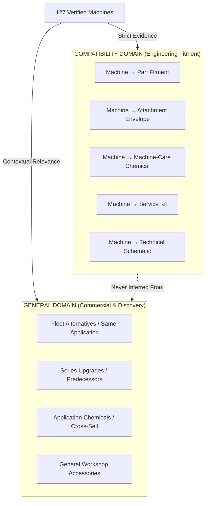

# Alkota UK — Product Relationship Domain Audit

**Date:** 10 September 2026  
**Status:** Canonical Reference Architecture Document  
**Specification:** Supplementary Architecture Prompt (Separate Compatibility from General Relationships)  

---

## 1. Executive Architecture Statement

The Alkota UK product catalogue connects machines, replacement parts, heavy-duty attachments, industrial chemical formulations, and technical workshop documentation. 

To maintain strict engineering integrity while simultaneously delivering rich commercial discovery and navigation across the storefront, the system enforces **two conceptually and structurally separated relationship domains**:

1. **`COMPATIBILITY` (Engineering Fitment & Specification)**
   - Answers: *"Can this product actually be physically installed on, operated with, plumbed into, or specified for this specific machine?"*
   - Examples: High-pressure pump direct mounting, burner coil geometry, surface cleaner pressure/flow operating envelope, coil descaler chemical approval.
   - **Rules:** Evidence-backed ONLY. Never inferred from title or category. Only published when confidence is `VERIFIED`, `MANUFACTURER_SUPPORTED`, or `UK_ENGINEERING_VERIFIED`. Records marked `REVIEW_REQUIRED` or `NOT_COMPATIBLE` are strictly withheld from public queries.

2. **`GENERAL` (Discovery, Commercial, & Lifecycle Relationships)**
   - Answers: *"What other equipment, alternatives, upgrades, or accessories are commercially or operationally relevant to this product?"*
   - Examples: Fleet alternatives (`ALTERNATIVE_PRODUCT`), series upgrades (`UPGRADE_TO`), related detergent solutions (`SAME_APPLICATION`), bundled accessories (`BUNDLE_COMPONENT`).
   - **Rules:** Editorial, commercial, and customer journey facilitation. Does **not** claim physical fitment or engineering interchangeability.

---

## 2. Legacy Data Audit & Classification

### 2.1 Existing Legacy Datastores Audited

| Legacy Location | Record Count | Existing Format | Architectural Classification | Action Taken |
|---|---|---|---|---|
| `src/lib/parts/catalogue-seed-v2.ts` | 50 Parts | `compatible_machines: string[]` (e.g. `['420X4', 'TRAILER-SINGLE']`) | Mixed: Direct OEM Fitment & Series Compatibility | Mapped to `COMPATIBILITY` domain with `MACHINE_PART` / `PART_MACHINE` semantics; fuzzy matching normalised. |
| `src/lib/attachments/seed-data.ts` | 20+ Attachments | `compatible_machines: AttachmentMachineCompatibility[]` (`machine_slug`, `status`) | Strict `COMPATIBILITY` domain (`MACHINE_ATTACHMENT`) | Integrated into `getMachineEcosystem()` with operating envelope verification (pressure bar / flow LPM bounds). |
| `src/lib/chemicals/seed-data.ts` | 8 Master Formulations | `compatible_equipment_types: string[]` (`'hot_water'`, `'parts_washer'`) | Generic Application Grouping | **Separated**: Machine-care descalers mapped to `COMPATIBILITY`, process cleaning chemicals mapped to `GENERAL` (`SAME_APPLICATION`). |
| Database `products` table | 127 Machines | Related machines / Series links | Mixed commercial & series | Shifted from hardcoded related grids to structured `GENERAL` domain relationships. |

### 2.2 Forensic Domain Separation Matrix



---

## 3. Database Schema Architecture

Database migration `supabase/migrations/027_product_relationships.sql` implements the canonical table:

```sql
CREATE TABLE IF NOT EXISTS product_relationships (
    id UUID PRIMARY KEY DEFAULT gen_random_uuid(),
    source_id TEXT NOT NULL,
    source_type TEXT NOT NULL DEFAULT 'machine',
    target_id TEXT NOT NULL,
    target_type TEXT NOT NULL DEFAULT 'part',
    relationship_domain TEXT NOT NULL CHECK (relationship_domain IN ('COMPATIBILITY', 'GENERAL')),
    relationship_type TEXT NOT NULL,
    status TEXT NOT NULL DEFAULT 'draft' CHECK (status IN ('draft', 'review', 'verified', 'published', 'rejected', 'archived')),
    confidence TEXT NOT NULL DEFAULT 'VERIFIED' CHECK (confidence IN ('VERIFIED', 'MANUFACTURER_SUPPORTED', 'UK_ENGINEERING_VERIFIED', 'REVIEW_REQUIRED', 'NOT_COMPATIBLE')),
    evidence TEXT,
    source_url TEXT,
    source_document TEXT,
    verification_date DATE,
    verified_by TEXT,
    notes TEXT,
    active BOOLEAN NOT NULL DEFAULT true,
    sort_order INTEGER NOT NULL DEFAULT 0,
    created_at TIMESTAMPTZ NOT NULL DEFAULT now(),
    updated_at TIMESTAMPTZ NOT NULL DEFAULT now(),
    CONSTRAINT uq_product_relationships UNIQUE (source_id, target_id, relationship_domain, relationship_type)
);
```

### 3.1 Security & RLS Policies

Public queries are subject to Row Level Security (RLS) rules:
1. Active & Published filter: `active = true AND status = 'published'`.
2. Domain-specific safeguard:
   ```sql
   AND (
       relationship_domain != 'COMPATIBILITY'
       OR confidence IN ('VERIFIED', 'MANUFACTURER_SUPPORTED', 'UK_ENGINEERING_VERIFIED')
   )
   ```
3. Negative or questionable records (`NOT_COMPATIBLE`, `REVIEW_REQUIRED`) can **never** be leaked to public API consumers or search indexers.

---

## 4. Frontend & Application Architecture

### 4.1 Machine Detail Experience (`/machines/[category]/[slug]`)

The machine detail page renders the unified `<MachineEcosystemSection />` component with four visually and semantically distinct tabs:

1. **Compatible Parts (`COMPATIBILITY`)**
   - Direct OEM fitment (Pumps, Unloaders, Coils, Burners, Switches).
   - Shows manufacturer part number, OEM brand badge, and exact evidence citation.
2. **Attachments & Accessories (`COMPATIBILITY`)**
   - Equipment operating within the machine's flow (LPM) and pressure (BAR) ratings.
   - Flow envelope verification notes (e.g. *"Rated for 250 BAR at 15 LPM"*).
3. **Approved Chemicals (`COMPATIBILITY` & `GENERAL` Divided)**
   - Sub-divided into **Machine Care Chemistry** (Descalers, Coil Cleaners, Defoamers verified for machine internals) and **Application Detergents** (Traffic film removers, degreasers for the work piece).
4. **Fleet Alternatives (`GENERAL`)**
   - High-capacity upgrades, mobile trailer alternatives, or alternative fuel platforms.
   - Distinct commercial disclaimer: *"Related equipment within the Alkota industrial fleet. Select based on duty cycle, power supply, or mobility requirements."*

### 4.2 Reverse Lookups on Part Pages (`/parts-attachments/product/[slug]`)

When viewing a part or attachment, the reverse compatibility service `getProductMachineCompatibility()` resolves machine models:
- Renders clickable verified machine cards linked to `/machines/[category]/[machine_slug]`.
- Displays verified pressure/flow ratings and evidence citations.
- Replaces inert text badges with interactive navigation.

### 4.3 Admin Relationship Studio (`/admin/relationships`)

Allows Alkota technical staff and catalogue editors to:
- Filter relationships by Domain (`COMPATIBILITY` vs `GENERAL`), Status, and Relationship Type.
- Create new relationships with mandatory evidence citation for compatibility claims.
- View immediate warnings when attempting to publish unverified compatibility claims.

---

## 5. Verification & Test Plan

17 automated tests verify:
- Domain isolation (`getCompatibleProducts` never leaks `GENERAL` records).
- Negative status filtering (`REVIEW_REQUIRED` and `NOT_COMPATIBLE` omitted from public lists).
- Reverse compatibility resolution for parts and attachments.
- Fuzzy model matching handles hyphenated, prefixed, and legacy model designations.
